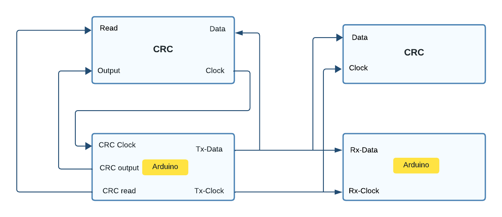

# CRC Hardware Implementation
The repo contains the implementation of the Cyclic Redundancy Check algorithm in hardware. This project is inspired by Ben Eater's YouTube series [Error Detection](https://www.youtube.com/playlist?list=PLowKtXNTBypFWff2QjXCWuSfJDWcvE0Vm) where he explains the error detection algorithms in detail.
A 16-bit Cyclic Redundancy Check (CRC) implementation in hardware is a crucial component for ensuring reliable communication between two networks. This error-checking mechanism is commonly used in data transmission to detect any accidental alterations during transmission.

In this setup, the hardware CRC generator employs a polynomial division algorithm to create a 16-bit CRC code for the outgoing data packet. This code is appended to the data before transmission. On the receiving end, another hardware CRC checker performs a similar division operation to calculate a CRC code from the received data. If the calculated CRC matches the received CRC, the data is considered error-free. If not, it indicates data corruption, and the packet is requested again.

This robust hardware-based CRC implementation ensures data integrity and enhances the overall reliability of network communication.

## Block Diagram

  

